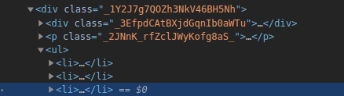

## 🐛 Bug report

As specified in the [documentation](https://razzlejs.org/docs/customization#css-modules)  on css-modules in razzle app.

I renamed `Home.css` to `Home.module.css` and import it in `Home.js` this way

```javascript
import React from 'react';
import styles from './Home.module.css';

class Home extends React.Component {
 render() {
    console.log(styles);
    return (
      <div className={styles.Home}>
{...}

```

This code triggers the following error.

`index.js:1 Warning: Prop  'className' did not match. Server: "_1Y2J7g7QOZh3NkV46BH5Nh" Client: "Home-module__Home___1Y2J7`

css classes look like this in server
```javascript
{
  Home: '_1Y2J7g7QOZh3NkV46BH5Nh',
  HomeLogo: '_2KkMUEjVuySUpRjrEeojGo',
  HomeLogoSpin: '_39wdp_vnGfmK3B1jpO1iRV',
  HomeHeader: '_3EfpdCAtBXjdGqnIb0aWTu',
  HomeIntro: '_2JNnK_rfZclJWyKofg8aS_',
  'Home-resources': '_3xjJ0Taxvc5cJK4jGLJPFn',
}

```
And like this in the browser.
```javascript
{
  Home: "Home-module__Home___1Y2J7",
  Home-resources: "Home-module__Home-resources___3xjJ0",
  HomeHeader: "Home-module__HomeHeader___3Efpd",
  HomeIntro: "Home-module__HomeIntro___2JNnK",
  HomeLogo: "Home-module__HomeLogo___2KkMU",
  HomeLogoSpin: "Home-module__HomeLogoSpin___39wdp",
}
```

When the class name is in kebab case, it is not present in html.



### Reproducible example

On new razzle app or https://github.com/bdeglane/razzle-css-modules-error

Same behavior on `yarn start` and `yarn start:prod`

### Your environment

| Software         | Version(s) |
| ---------------- | ---------- |
| Razzle           | ^4.0.0-canary.14
| Node             | 12.18.1
| Browser          | any
| npm/Yarn         | yarn 1.22.10
| Operating System | linux
| React            | ^17.0.1

I have the same behavior on my current project with typescript

| Software         | Version(s) |
| ---------------- | ---------- |
| Razzle           | ^3.3.7
| TypeScript       | ^3.8.3

